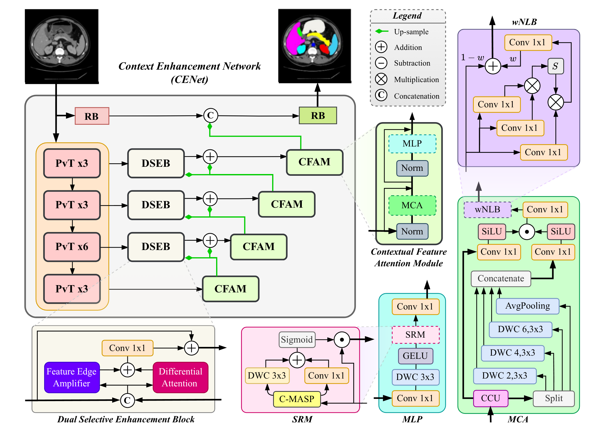
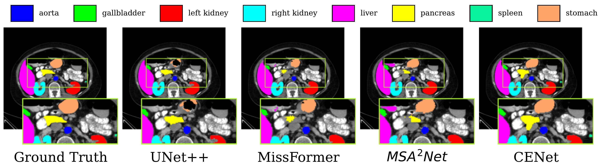
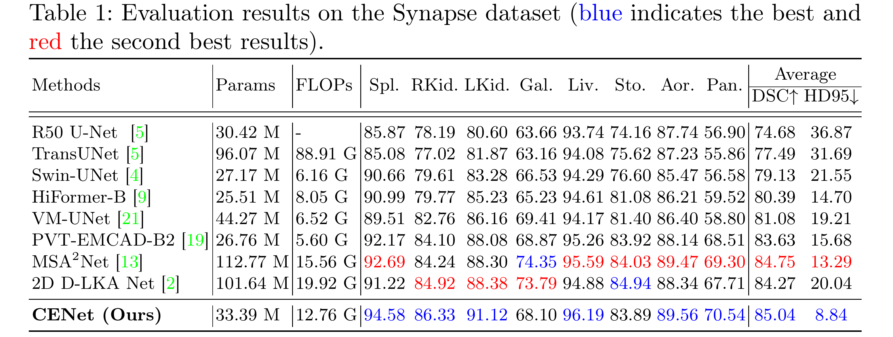
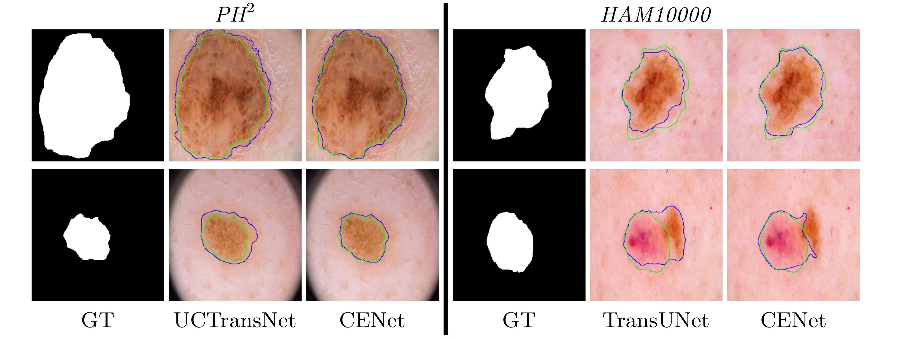
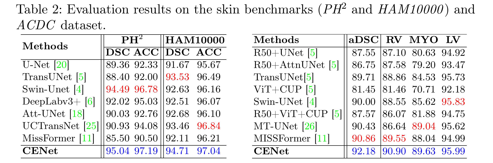

# CENet: Context Enhancement Network for Medical Image Segmentation

<p align="center">
  <a href="http://arxiv.org/abs/2505.18423">
    
  </a>
  <br>
  <sub><sup>MICCAI 2025 Early Accept (Top 9%) — Code released 10.07.2025</sup></sub>
</p>

A unified PyTorch implementation of **CENet**, our Context Enhancement Network for robust, high-resolution segmentation across multiple medical domains (cardiac MRI, abdominal CT, dermoscopy).

---

<!-- ## Updates
- **`10.07.2025`** | Code Released
- **`22.05.2025`** | Early Accepted (Top 9%) in MICCAI 2025! 🥳 -->


## 📖 Table of Contents

- [Abstract](#abstract)  
- [Installation](#installation)  
- [Repository Structure](#repository-structure)  
- [Pre-trained Weights](#pre-trained-weights)  
- [Data Preparation](#data-preparation)  
- [Usage](#usage)  
  - [ACDC (2D Cardiac MRI)](#acdc-2d-cardiac-mri)  
  - [Synapse (Abdominal CT)](#synapse-abdominal-ct)  
  - [Skin Lesion (HAM10000 & PH2)](#skin-lesion-ham10000--ph2)  
- [Results](#results)  
- [Citation](#citation)  
- [Acknowledgements](#acknowledgements)  

---

## 📝 Abstract

Medical image segmentation, particularly in multi-domain scenarios, requires precise preservation of anatomical structures across diverse representations. While deep learning has advanced this field, existing models often struggle with accurate boundary representation, variability in organ morphology, and information loss during downsampling, limiting their accuracy and robustness. To address these challenges, we propose the Context Enhancement Network (CENet), a novel segmentation framework featuring two key innovations. First, the Dual Selective Enhancement Block (DSEB) integrated into skip connections enhances boundary details and improves the detection of smaller organs in a context-aware manner. Second, the Context Feature Attention Module (CFAM) in the decoder employs a multi-scale design to maintain spatial integrity, reduce feature redundancy, and mitigate overly enhanced representations. Extensive evaluations on both radiology and dermoscopic datasets demonstrate that CENet outperforms state-of-the-art (SOTA) methods in multi-organ segmentation and boundary detail preservation, offering a robust and accurate solution for complex medical image analysis tasks.



---

## ⚙️ Installation

1. **Clone this repository**  
   ```bash
   git clone https://github.com/xmindflow/cenet.git
   cd cenet
   ```

2. **Install PyTorch & core libraries**

   ```bash
   pip install torch==2.7.0 torchvision==0.22.0 torchaudio==2.7.0 \
     --index-url https://download.pytorch.org/whl/cu128
   ```

3. **Install remaining dependencies**

   ```bash
   pip install -r requirements.txt
   ```

> **ℹ️ Tested on Python 3.10.16 and CUDA 12.9.**

---

## 📂 Repository Structure

```
.
├── pretrained_pth/
│   └── pvt/
│       └── pvt_v2_b2.pth           # Pre-trained PVTv2 backbone
├── weights/                        # Downloaded checkpoints (see below)
├── scripts/
│   ├── acdc.sh                     # ACDC train/test
│   ├── synapse.sh                  # Synapse train/test
│   └── skin.sh                     # HAM10000 & PH2 train/test
├── src/                            # Code
│   ├── datasets/                   # Data loaders
│   ├── networks/                   # Model definitions
│   ├── utils/                      # Training & eval utilities
│   └── main_*.py                   # Entry points
├── requirements.txt  
└── README.md
```

---

## 📦 Pre-trained Weights

All dataset- and network-specific checkpoints (\~590 MB) are hosted on Mega.nz:

1. **Download & extract**

   - **Manual**  
     1. Open in your browser:  
        https://mega.nz/file/MRdDHSwL#tJLJf_JUixmsxC2DRMcP0XZMBdQ6CVLTgxImH_PBdOo  
     2. Download the file named `cenet_weights.zip`.  
     3. From your terminal, unzip into the `weights/` folder:  
        ```bash
        unzip cenet_weights.zip -d weights
        ```
   
   - **CLI (using megatools)**  
     ```bash
     # install megatools if you don't have it
     sudo apt-get update && sudo apt-get install -y megatools

     # download directly from Mega.nz
     megadl 'https://mega.nz/file/MRdDHSwL#tJLJf_JUixmsxC2DRMcP0XZMBdQ6CVLTgxImH_PBdOo'

     # unzip into weights/
     unzip MRdDHSwL.zip -d weights
     ```

2. After extraction, `weights/` should contain:

   ```
   acdc_2418732.pth
   ham10k_2418602.pth
   ph2_2418571.pth
   synapse_2418962.pth
   synapse_cenet_org_2352272.pth
   ```

> The **PVTv2** encoder (`pvt_v2_b2.pth`) is already in `pretrained_pth/pvt/` and is only required for training.

---

## 🗄️ Data Preparation

Organize your datasets as follows:

### ACDC (2D Cardiac MRI)

```
/path/to/ACDC_2D/
├── list_ACDC/    # CSVs or TXT files listing train/val/test splits
├── train/
├── valid/
└── test/
```

### Synapse (Abdominal CT)

```
/path/to/Synapse/
├── lists/        # Train/test split lists
├── train_npz/    # Preprocessed .npz volumes
└── test_vol_h5/  # HDF5 volumes for evaluation
```

### Skin Lesion (HAM10000 & PH2)

```
/path/to/Skin/
├── HAM10000/     # Raw images + labels
└── PH2/          # Raw images + labels
```

---

## 🚀 Usage

Each script in `scripts/` automates both training and evaluation. **Open the script** and set:

```bash
# 1. CENET_DIR    → Full path to this repository
# 2. DATA_DIR     → Full path to the dataset (see Data Preparation)
# 3. RESULTS_DIR  → Full path to save results
# 4. PT_DIR       → Path to pre-trained encoder:
#                   $CENET_DIR/pretrained_pth/pvt
# 5. EVAL_PT      → Path to the dataset-specific CENet checkpoint
#                   weights/*.pth
# 6. EVAL_PT_ORG  → [Synapse only] Path to original-CENet checkpoint
```

### ACDC (2D Cardiac MRI)

```bash
bash scripts/acdc.sh TRAIN   # trains from PVTv2
bash scripts/acdc.sh TEST    # evaluates using $EVAL_PT
```

### Synapse (Abdominal CT)

```bash
bash scripts/synapse.sh TRAIN      # trains clean CENet
bash scripts/synapse.sh TEST       # eval clean CENet
bash scripts/synapse.sh TEST_ORG   # eval original CENet (paper)
```

### Skin Lesion (HAM10000 & PH2)

```bash
# HAM10000
bash scripts/skin.sh HAM TRAIN
bash scripts/skin.sh HAM TEST

# PH2
bash scripts/skin.sh PH2 TRAIN
bash scripts/skin.sh PH2 TEST
```

> **Tip:** Uncomment `--amp` for mixed precision or `--compile` to use `torch.compile()`.

---

## 📈 Results

Visual comparison of the proposed method versus others on the Synapse dataset.




Qualitative comparison of CENet and previous methods across skin benchmarks.





---

## 📚 Citation

Please cite our paper if you use this code:

```bibtex
@article{bozorgpour2025cenet,
  title   = {CENet: Context Enhancement Network for Medical Image Segmentation},
  author  = {Bozorgpour, Afshin and Kolahi, Sina G. and Azad, Reza and Hacihaliloglu, Ilker and Merhof, Dorit},
  journal = {arXiv preprint arXiv:2505.18423},
  year    = {2025}
}
```

---

## 🤝 Acknowledgements

* This implementation leverages design ideas and utilities from [EMCAD](https://github.com/SLDGroup/EMCAD).
* We also incorporate modules inspired by [MogaNet](https://github.com/Westlake-AI/MogaNet).
* Thanks to the authors of those projects for their open-source contributions.

---

*Enjoy! Feel free to open an issue or pull request with any questions or improvements.*
